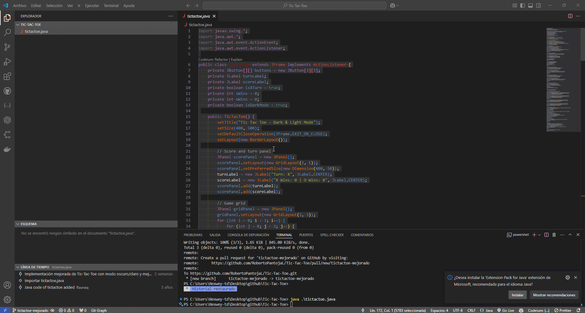
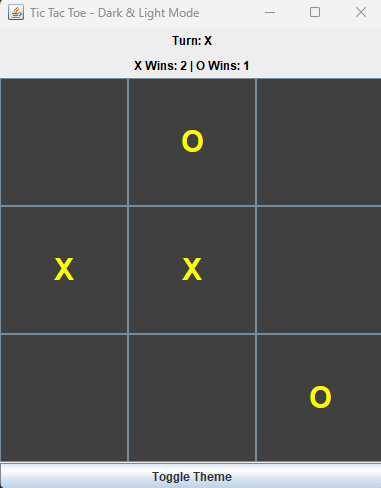
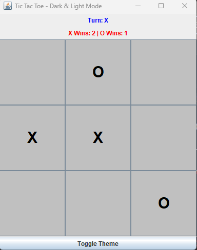

# Tic Tac Toe - Dark & Light Mode

Este es un juego clásico de Tic Tac Toe (Tres en raya) implementado en Java utilizando la biblioteca Swing para la interfaz gráfica. El juego incluye dos modos de tema: oscuro y claro, que pueden alternarse con un botón.

## Vista previa


## Características

- **Interfaz gráfica**: El juego utiliza `JFrame` y `JButton` para crear una interfaz gráfica amigable.
- **Modos de tema**: El juego tiene dos modos de tema: oscuro y claro. Puedes cambiar entre ellos con el botón "Toggle Theme".
- **Turnos alternados**: Los jugadores alternan turnos entre "X" y "O".
- **Detección de ganador**: El juego detecta automáticamente cuando un jugador gana o si hay un empate.
- **Marcador**: Se lleva un registro de las victorias de "X" y "O".

## Requisitos

- Java Development Kit (JDK) 8 o superior.
- Un entorno de desarrollo integrado (IDE) como IntelliJ IDEA, Eclipse, o cualquier editor de texto con soporte para Java.

## Cómo ejecutar el juego

1. Clona o descarga este repositorio.
2. Abre el proyecto en tu IDE.
3. Compila y ejecuta la clase `TicTacToe`.

```
javac TicTacToe.java

java TicTacToe
```
## Cómo jugar
1. Al iniciar el juego, se mostrará un tablero de 3x3.

2. Los jugadores alternan turnos haciendo clic en los botones del tablero.

3. El jugador "X" siempre comienza.

4. El juego detectará automáticamente si hay un ganador o un empate.

5. Puedes cambiar entre los modos oscuro y claro usando el botón "Toggle Theme".

## Estructura del código
- TicTacToe.java: Contiene la lógica principal del juego, incluyendo la interfaz gráfica y la gestión de eventos.

- Métodos principales:

  - **toggleTheme()**: Cambia entre los modos oscuro y claro.

  - **setDarkMode()** y **setLightMode()**: Configuran los colores y estilos para cada tema.

  - **resetBoard()**: Reinicia el tablero para una nueva partida.

  - **checkWinner()**: Verifica si hay un ganador o un empate.

Capturas de pantalla
### Modo Oscuro


### Modo Claro


## Contribuciones
Si deseas contribuir a este proyecto, siéntete libre de hacer un fork y enviar un pull request. Cualquier mejora o sugerencia es bienvenida.

## Licencia
Este proyecto está bajo la licencia MIT. Consulta el archivo LICENSE para más detalles.

¡Diviértete jugando! 🎮
